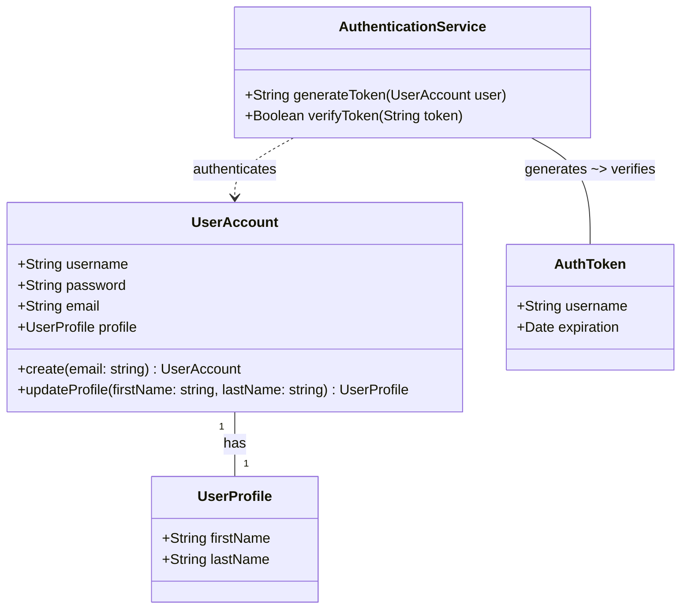

node を勉強するために、JWT の認証システムを作ってみました。
クラス図は ChatGPT に書かせて、手直ししたやつになります。

## クラス図



JWT での認証を行うためによくあるある（だと思っている）RS256 を作った JWT 検証をやってみます。

## とりあえず JWT 用の鍵を作る

```typescript
// https://nodejs.org/api/crypto.html
import crypto from 'crypto'

// Generate a key pair
const { publicKey, privateKey } = crypto.generateKeyPairSync("rsa", {
  modulusLength: 2048,
  publicKeyEncoding: { type: "spki", format: "pem" },
  privateKeyEncoding: { type: "pkcs8", format: "pem" },
});
```

## クラス図にあわせてドメインモデル作成

```typescript
import jwt from 'jsonwebtoken'

class UserAccount {
  username: string
  password: string
  email: string
  profile: UserProfile

  static create(email: string): UserAccount {
    const emailRegex = /^[^\s@]+@[^\s@]+\.[^\s@]+$/
    if (!emailRegex.test(email)) {
      throw new Error('無効なメールアドレスです。')
    }

    const account = new UserAccount()
    account.#generatePassword()
    account.username = email.split('@')[0]
    account.email = email
    return account
  }

  updateProfile(firstName: string, lastName: string): UserProfile {
    this.profile = new UserProfile()
    this.profile.firstName = firstName
    this.profile.lastName = lastName
    return this.profile
  }

  #generatePassword(): void {
    const characters = 'ABCDEFGHIJKLMNOPQRSTUVWXYZabcdefghijklmnopqrstuvwxyz0123456789!@#$%^&*()'
    let password = ''
    for (let i = 0; i < 12; i++) {
      password += characters.charAt(Math.floor(Math.random() * characters.length))
    }
    this.password = password
  }
}

class UserProfile {
  firstName: string
  lastName: string
}

class AuthenticationService {
  #PRIVATE_KEY = privateKey
  #PUBLIC_KEY = publicKey

  generateToken(username: string): string {
    const token = jwt.sign({ username }, this.#PRIVATE_KEY, { algorithm: 'RS256', expiresIn: '1h' })
    return token
  }

  verifyToken(token: string): string {
    const payload = jwt.verify(token, this.#PUBLIC_KEY, { algorithm: 'RS256' })
    return payload.username
  }
}
```

## あとはドメインモデル使ってみる

AuthenticationService を使用して JWT トークンを作成します。

```typescript
const service = new AuthenticationService()
const token = service.generateToken(account.username)

const payload = token.split('.');
const header = Buffer.from(payload[0], 'base64').toString('utf-8');
const claim = Buffer.from(payload[1], 'base64').toString('utf-8');
console.log(`Header: ${header}`);
console.log(`Claim: ${claim}`);

// Header: {"alg":"RS256","typ":"JWT"}
// Claim: {"username":"inoue","iat":1710581161,"exp":1710584761}
```

作った JWT トークンを検証すると正常にクレームが取得できたのが確認できました。

```typescript
const service = new AuthenticationService()
const result = service.verifyToken(token)
console.log(`Success: ${result}`)
// Success: inoue
```

失敗するパターンも確認します。

```typescript
const service = new AuthenticationService()
try {
  service.verifyToken('hoge');
} catch (error) {
  console.log(error)
}
// JsonWebTokenError: jwt malformed
```

## さいごに
JWT 使って使ってよくあるある認証システムを作ることを確認できましたね！
次はこのコードのテストコードとか書きたいなと妄想しています。
