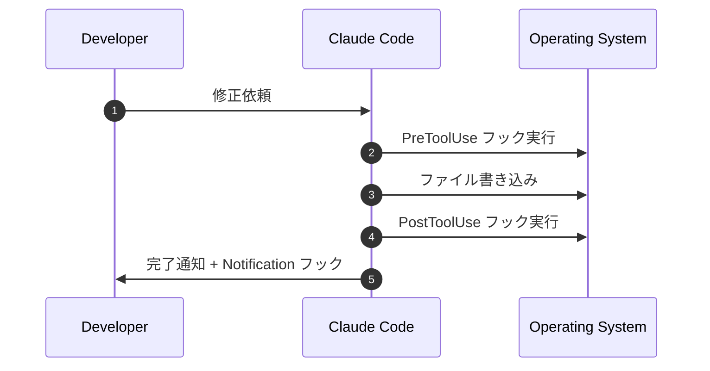

## はじめに

2025 年 7 月は、AI コーディングエージェント **Claude Code** にとって機能面で最も動きの多い月となりました。本記事では、**7 月 1 日〜 7 月 20 日**までにリリース・改善された主要アップデートを時系列で整理し、開発現場への影響と活用ポイントを解説します。

---

## アップデート早見表

| 日付 | 機能 / バージョン | 概要 |
|------|------------------|------|
| 7/03 | **Hooks 機能** (CLI v0.23.0) | PreToolUse / PostToolUse / Notification の 3 つのフックで任意シェルコマンドを自動実行 |
| 7/07 | **VSCode 拡張 v0.4.0** | インライン Reasoning 表示、テストスニペット自動生成、Hooks 設定 UI 追加 |
| 7/10 | **`graph` コマンド強化** | 依存関係グラフがインクリメンタル更新に対応し、描画速度 40% 向上 |
| 7/14 | **Plan プレビュー (`--plan`)** | 書き込み系ツール実行前に差分と実行コストを提示 |
| 7/15 | **Opus 4 早期アクセス** | `--model opus-4-preview` フラグで利用可能（Max プラン限定） |
| 7/17 | **レートリミット UI 表示** | `claude status` で残メッセージ数と次回リセット時刻を明示 |
| 7/19 | **Latency 改善** | 新 GPU バックエンドで平均応答時間を 30% 短縮 |

---

## 1. Hooks 機能（7 月 3 日）



### 1.1 何ができる？
- **PreToolUse**：ファイル変更前に Linter やセキュリティスキャンを自動実行
- **PostToolUse**：フォーマッタや単体テストを即時起動
- **Notification**：Slack / Discord Webhook で完了を共有

### 1.2 導入ステップ
```bash
claude hooks add pre "npm run lint"
claude hooks add post "pytest -q"
claude hooks add notify "curl -X POST $WEBHOOK_URL -d 'Done'"
```

---

## 2. VSCode 拡張 v0.4.0（7 月 7 日）

- **Reasoning Pane**：Claude が思考したステップをサイドバーで可視化
- **Generate Tests**：右クリック → _Generate Unit Tests_ で `*.test.(ts|py)` を自動生成
- **Hooks GUI**：`Claude: Open Hooks Settings` で JSON を書かずに設定可能

> Tip: `claude.json` と VSCode 設定は双方向同期されるため、CLI 派と GUI 派どちらでも編集可能です。

---

## 3. `graph` コマンドの高速化（7 月 10 日）

依存解析をインクリメンタルに実行することで、大規模モノレポでも **描画速度が約 40% 向上**。`--focus <path>` オプションで特定パッケージのみ抽出可能になりました。

```bash
claude graph --focus packages/core > graph.svg
```

---

## 4. Plan プレビュー (`--plan`)（7 月 14 日）

破壊的変更を防ぐため、書き込み系ツール（`write_file`, `edit_file` など）の前に **差分と推定トークンコスト** を表示。

```bash
claude edit src/index.ts --plan "Convert callbacks to async/await"
```

実行するとパッチとコスト見積もりが提示され、`y/n` で確定できるようになりました。

---

## 5. Opus 4 早期アクセス（7 月 15 日）

Max プランユーザー限定で、次世代モデル **Opus 4** を試用可能。

- HumanEval 80% 前後のスコア（社内ベンチ）
- コンテキスト上限 256K トークン

```bash
claude --model opus-4-preview "Refactor payment module"
```

> 注意: レートリミットは従来の 1/2 に設定。高コストのため大量呼び出しは非推奨。

---

## 6. レートリミット UI 表示（7 月 17 日）

CLI で以下を実行すると、残メッセージ数とリセット時刻が確認可能になりました。

```bash
claude status
# 残り 42 メッセージ | 次回リセット 02:15 UTC
```

---

## 7. レイテンシ改善（7 月 19 日）

Anthropic は GPU クラスタを新アーキテクチャに移行。公式発表によれば **平均応答時間が 30% 短縮** され、特に長文生成で体感速度が向上しています。

---

## まとめと次の一手

- Hooks による **CI/CD 連携自動化** は導入効果が大きい。
- VSCode v0.4.0 で **思考過程の可視化 & テスト生成** がワンステップに。
- Plan プレビューとレートリミット表示で **安全性と予測可能性** が向上。
- Opus 4 は魅力的だが、高コストかつリミット厳しめ。クリティカルパスのみでの活用が吉。

> **おすすめアクション**：まずは Hooks と Plan プレビューを試し、CI に組み込むことでチームの生産性を即時に体感しましょう。

---

### 参考リンク
- リリースノート: <https://github.com/anthropic/claude-code/releases>
- VSCode Marketplace: <https://marketplace.visualstudio.com/items?itemName=anthropic.claude-code>
- Opus 4 早期アクセス FAQ: <https://docs.anthropic.com/opus4/early-access>

---

この記事は新たなアップデートが入り次第、随時更新します。
