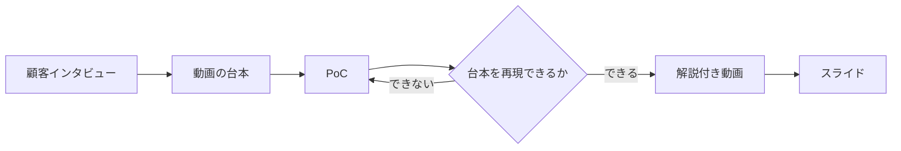

## はじめに

業務委託で開発に入ると、「作りたいものはあるが、要件は固まっていない」という案件に出会うことが少なくありません。打ち合わせで「だいたいこういう感じで」と聞いて持ち帰り、作っている途中で決まっていないことが次々と出てくる。この問題の多くはヒアリングの抜け漏れに起因しますが、「何を聞くか」だけでなく「聞いた結果をどういう形にして、何をもって合意とするか」も同じくらい重要です。

筆者がここ最近の案件で手応えを感じているのは、次の流れです。

1. 顧客インタビューで課題を特定する
2. **動画で見せるべきユースケースを台本として先に書く**
3. PoC を作る
4. PoC が台本のユースケースを再現できるか検証する
5. 解説付きの動画を作る
6. 動画をもとにスライドを作る

この記事では、この流れが既存の方法論とどう対応するのか、業務委託の契約類型とどう結びつくのか、そして最近増えている AI エージェント型サービスではどこに注意が要るのかを整理します。一次ソースを確認できた範囲で書き、確認できなかったものはその旨を明記します。

:::message
この記事は AI の話を含みますが、中心は受託開発の進め方です。ステップ1のヒアリングの具体的な方法は、以前書いた [Claude Code の AskUserQuestion で要件ヒアリングを構造化する記事](https://zenn.dev/ino_h/articles/2026-05-10-claude-code-askuserquestion-hearing) を参照してください。
:::

## 提案する流れ — 「動画の台本」が仕様になる

最初に考えていたときは、この流れの中で E2E テストを主役として捉えていました。PoC を作り、E2E を書き、それを動画にする、という順です。ただ、改めて考えると E2E は手段でしかありません。大事なのは、**顧客に見せたいユースケースを PoC が再現できるかどうか**です。その確認を E2E 自動テストで行うか、手動の通し確認で行うか、録画そのもので行うかは、案件の規模次第で選べばよい話です。

そう整理し直すと、流れの中で一番重要な成果物は「動画の台本」になります。



台本には、次のことを書きます。

- 誰が、どんな状況で、何をしたくて使うのか
- 画面やエージェントがどう応答するのか
- どこで人間が判断するのか（AI エージェント型サービスの場合、後述します）
- 動画の中で「ここを見てほしい」と言いたい場面はどこか

この台本を顧客と一緒に書き、合意してから PoC を作ります。PoC は、台本の場面を再現できる最小限で構いません。

## 各工程を既存の方法論に対応づける

この流れは筆者が独自に考えたものではなく、既存の方法論を一本につないだものです。対応を確認しておくと、顧客に説明するときの根拠になります。

| 工程 | 対応する方法論 |
|---|---|
| 1. 顧客インタビュー | GDS の Discovery フェーズ、Amazon の Working Backwards |
| 2. 動画の台本 | Carroll の Scenario-based design、Working Backwards の PR/FAQ |
| 3. PoC | GDS の Alpha フェーズ、Design Sprint のプロトタイプ |
| 4. 台本の再現を検証 | BDD の Discovery → Formulation → Automation |
| 5〜6. 動画・スライド | Design Sprint の顧客テスト |

### 1. 顧客インタビュー — 作る前に問題を理解する

英国政府のデジタルサービス部門（GDS）が公開している Service Manual では、Discovery フェーズの目的を次のように書いています。

> Before you commit to building a service, you need to understand the problem that needs to be solved.
>
> — [GOV.UK Service Manual: How the discovery phase works](https://www.gov.uk/service-manual/agile-delivery/how-the-discovery-phase-works)

そして、この段階では作らないことを明言しています。

> You should not start building your service in discovery.
>
> — 同上

Amazon の Working Backwards も同じ発想です。

> Working Backwards is a systematic way to vet ideas and create new products. Its key tenet is to start by defining the customer experience, then iteratively work backwards from that point until the team achieves clarity of thought around what to build.
>
> — [About Amazon: An insider look at Amazon's culture and processes](https://www.aboutamazon.com/news/workplace/an-insider-look-at-amazons-culture-and-processes)

Working Backwards の中心的な道具は PR/FAQ です。製品が完成したと仮定してプレスリリース（1ページ以内）と FAQ（5ページ以内）を先に書きます。「動画の台本を先に書く」は、この PR/FAQ を動画という形式に置き換えたものと言えます。

### 2. 動画の台本 — Scenario-based design

「利用場面を具体的な物語として書き、それを要件の中心に置く」という考え方は、John M. Carroll の Scenario-based design として 1990 年代から研究されています。1998 年の論文では、教師と開発者が一緒にシナリオを書くケーススタディについて次のように述べています。

> Our design work centered on the collaborative development of a series of scenarios describing current and future classroom activities.
>
> — [Carroll, "Requirements development in scenario-based design", IEEE Transactions on Software Engineering, 1998](https://pure.psu.edu/en/publications/requirements-development-in-scenario-based-design/)

ポイントは「現在の活動」と「将来の活動」の両方をシナリオにすることと、顧客と**一緒に**書くことです。動画の台本も、顧客が「自分たちの業務の話だ」と思える粒度で、顧客と一緒に書きます。

### 3. PoC — 検証に必要な分だけ作る

GDS の Alpha フェーズは、Discovery で見つけた問題に対して解決策を試す段階です。

> Spend alpha building prototypes and testing different ideas
>
> — [GOV.UK Service Manual: How the alpha phase works](https://www.gov.uk/service-manual/agile-delivery/how-the-alpha-phase-works)

重要なのは、本番品質で作らないことです。

> build things that are just complex enough to let you test different ideas, not production quality code
>
> — 同上

Design Sprint も同じ立場です。

> The big idea with the Design Sprint is to build a prototype of your idea and test it with real customers.
>
> — [The Design Sprint (Character)](https://www.character.vc/sprint)

PoC は台本を再現するためだけに作り、本番コードにするかどうかは別に判断します。

### 4. 台本の再現を検証 — BDD の3段階

BDD（振る舞い駆動開発）の Cucumber 公式ドキュメントは、BDD を3つの実践に分けています。

> Discovery: take a small upcoming change to the system -- a User Story -- and talk about concrete examples of the new functionality to explore, discover and agree on the details
>
> Formulation: formulate each example as structured documentation. This gives us a quick way to confirm that we really do have a shared understanding of what to build.
>
> Automation: use it to guide our development of the implementation. Taking one example at a time, we automate it by connecting it to the system as a test.
>
> — [Cucumber: Behaviour-Driven Development](https://cucumber.io/docs/bdd/)

台本を書く工程は、この Formulation にあたります。具体例を Gherkin で書くか、動画の台本として書くかの違いで、「具体例が仕様になる」という発想は同じです。E2E 自動テストは3段階の最後の Automation であり、Cucumber 自身もそれを最後に置いています。E2E を手段として捉え直したのは、この順序に沿った判断です。

請負フェーズに進んで本番コードを書くときに、台本を E2E に書き直せば回帰テストになります。台本は捨てずに育て、PoC は捨ててもよい、という関係になります。

### Shape Up の「作る前にどこまで決めるか」

Basecamp の Shape Up は、作る前に仕事を「形づくる（shaping）」ことを重視しています。

> Shaped work has been thought through. All the main elements of the solution are there at the macro level and they connect together.
>
> — [Shape Up: Principles of Shaping](https://basecamp.com/shapeup/1.1-chapter-02)

ただし、細かく決めすぎることにも注意を促しています。

> When design leaders go straight to wireframes or high-fidelity mockups, they define too much detail too early. This leaves designers no room for creativity.
>
> — 同上

台本は、場面の流れを決めますが、画面の細部までは決めません。Shape Up の言う「粗いが解けている」状態に近い粒度を目指します。

## 「demo-driven development」との違い

「デモを中心に開発を進める」というと、demo-driven development という既存の用語があります。混同を避けるために整理しておきます。

Jade Rubick 氏が 2021 年に書いた記事での定義は次のとおりです。

> Demo-driven development is a practice where you use regular demos, a standard week-by-week project plan, and value-based user stories.
>
> — [Jade Rubick: Demo driven development](https://www.rubick.com/demo-driven-development/)

毎週の計画で「what should we demo on Friday?」と問い、金曜のデモを計画の単位にする、という実装フェーズの運用方法です。デモの内容は「a reasonable guess」であり、作る前に固定するものではない、とも書かれています。

この記事で提案しているのは「台本を先に書いて仕様にする」ことなので、Rubick 氏の demo-driven development とは別の話です。ただし衝突するわけではなく、台本で合意したあとの実装フェーズを「毎週のデモで進める」運用は相性がよいと考えています。

:::message
「The voice-over is the spec（ナレーションが仕様である）」という、この記事の考え方にさらに近い実践を検索で見かけましたが、一次ソースを確認できなかったため、ここでは紹介にとどめます。
:::

## 契約類型との関係 — 台本を準委任フェーズの納品物にする

業務委託でこの流れを使うなら、契約類型との対応を押さえておく必要があります。

IPA（情報処理推進機構）が公開している「情報システム・モデル取引・契約書」では、工程ごとに契約類型を分けています。追補版の重要事項説明書には次のように書かれています。

> 重要事項説明書 D外部設計支援業務契約：準委任・(21)～(23)適用、Eソフトウェア設計・制作契約：請負・(25)～(29)適用、F構築・設定業務契約：請負・(30)～(32)適用
>
> — [IPA: 情報システム・モデル取引・契約書（追補版）重要事項説明書](https://www.ipa.go.jp/digital/model/ug65p90000001lgm-att/000090723.pdf)

要件定義支援・外部設計支援は準委任、ソフトウェア設計・制作は請負、というのが公式の推奨です。

この分け方にこの記事の流れを重ねると、次のようになります。

| フェーズ | 契約類型 | 成果物 |
|---|---|---|
| インタビュー → 台本 → PoC → 動画 → スライド | 準委任 | 台本、PoC、動画、スライド |
| 本番実装 | 請負 | 動作するシステム、E2E テスト |

準委任は成果物の完成責任を負わない代わりに、何をどう進めたかを説明する責任があります。台本・動画・スライドは、この説明責任を果たす成果物としてそのまま使えます。発注側から見ても、「請負に進むかどうか」を判断する材料がこの時点で揃うことになります。

:::message
準委任における説明責任と成果物の関係は、筆者の整理であり、法的な裏付けを確認したものではありません。契約条件は案件ごとに専門家に相談してください。
:::

## AI エージェント型サービスでの追加論点

最近の案件では、AI エージェントを組み込んだサービスの構築が増えています。この場合、台本に書くべきことが2つ増えます。

1. **人間がどのタイミングで意思決定するか**
2. **AI の応答がユーザにとってどれだけ理解しやすいか**

### 人間の意思決定ポイントを台本に書く

Anthropic は、エージェントの設計について次のように述べています。

> Agents can then pause for human feedback at checkpoints or when encountering blockers.
>
> — [Anthropic: Building effective agents](https://www.anthropic.com/engineering/building-effective-agents)

OpenAI のガイドは、人間に戻す条件をより具体的に2つ挙げています。

> Exceeding failure thresholds: Set limits on agent retries or actions. If the agent exceeds these limits (e.g., fails to understand customer intent after multiple attempts), escalate to human intervention.
>
> High-risk actions: Actions that are sensitive, irreversible, or have high stakes should trigger human oversight until confidence in the agent's reliability grows. Examples include canceling user orders, authorizing large refunds, or making payments.
>
> — [OpenAI: A practical guide to building agents](https://cdn.openai.com/business-guides-and-resources/a-practical-guide-to-building-agents.pdf)

つまり「失敗が続いたとき」と「不可逆・高リスクな操作の前」が、人間の意思決定ポイントです。さらに「until confidence in the agent's reliability grows」とあるように、**初期ほど人間の承認を多く置き、実績が積み上がってから減らす**という時間軸の考え方が示されています。

これを台本に落とすと、「ここで AI が人間に確認する」という場面を明示的に書くことになります。顧客と一緒に「どの操作は AI が勝手にやってよくて、どの操作は人間が承認するのか」を表にし、台本の中でその場面を見せます。準委任フェーズの間は承認ポイントを多めに置き、請負フェーズで実績を見ながら自動化範囲を広げる、という進め方は契約の区切りとも一致します。

なお Anthropic は、そもそもエージェントにする前に、もっと単純な構成で足りないかを問うべきだとも述べています。

> For many applications, however, optimizing single LLM calls with retrieval and in-context examples is usually enough.
>
> — 同上

台本を書いてみて、人間の判断ポイントがほとんどない直線的な流れなら、エージェントではなく単発の LLM 呼び出しで十分かもしれません。台本はその判断にも使えます。

### 説明のわかりやすさを台本のチェック項目にする

AI の応答がユーザにとって理解しやすいかどうかは、動画で顧客に見せたときに一番反応が出る部分です。ここには既存のガイドラインが使えます。

Anthropic は3原則の2番目に透明性を挙げています。

> Prioritize transparency by explicitly showing the agent's planning steps.
>
> — [Anthropic: Building effective agents](https://www.anthropic.com/engineering/building-effective-agents)

Microsoft の HAX Toolkit にある「Guidelines for Human-AI Interaction」18 項目のうち、台本のチェックに直結するのは次の項目です。

| 番号 | ガイドライン | 台本で確認すること |
|---|---|---|
| G1 | Make clear what the system can do | 最初に AI が何をできるかを伝えているか |
| G2 | Make clear how well the system can do what it can do | どのくらい間違えるかを伝えているか |
| G9 | Support efficient correction | 間違ったときにユーザが直しやすいか |
| G10 | Scope services when in doubt | 迷ったときに確認するか、控えめに動くか |
| G11 | Make clear why the system did what it did | なぜそうしたかの説明にアクセスできるか |

出典: [Microsoft HAX Toolkit: Guidelines for Human-AI Interaction](https://www.microsoft.com/en-us/haxtoolkit/library/?content_type%5B%5D=guideline)

Google の PAIR Guidebook は、説明の目的を「信頼させること」ではなく「信頼を較正すること」に置いています。

> the user shouldn't trust the system completely. Rather, based on system explanations, the user should know when to trust the system's predictions and when to apply their own judgement.
>
> — [People + AI Guidebook: Explainability + Trust](https://pair.withgoogle.com/chapter/explainability-trust/)

確信度の表示については、出せばよいわけではないと注意しています。

> Displaying model confidence can sometimes help users calibrate their trust and make better decisions, but it's not always actionable.
>
> — 同上

動画の台本に「AI がなぜそう判断したかを見せる場面」を入れ、顧客に「この説明で判断できますか」と聞きます。動画を先に作ってからスライドにする順序は、この「説明の見せ方」を実物で確認してから抽象化する、という意味づけができます。

## 台本のテンプレート例

筆者が使っている台本の形式を、簡略化して示します。Markdown で書き、顧客と共有して一緒に直します。

```markdown
# 動画台本: 経費精算エージェント（v0.3）

## 登場人物
- 申請者: 営業部の社員。月末にまとめて領収書を処理する
- 承認者: 営業部の部長。金額が大きいものだけ確認したい

## 場面1: 領収書をまとめて投入する
- 申請者が領収書の画像を10枚ドラッグする
- エージェントが各画像から日付・金額・店名を読み取り、一覧にする
- 【説明】読み取れなかった項目は「未確定」と表示し、理由を添える（G11）
- 【見せ場】読み取り結果を申請者がその場で直せる（G9）

## 場面2: 経費区分を提案する
- エージェントが各行に経費区分を提案する
- 【説明】「過去の同じ店名の申請では交通費だった」のように根拠を表示する
- 【人間の判断】申請者が区分を確定する。エージェントは勝手に確定しない

## 場面3: 承認者に回す
- 合計が一定額を超える場合、エージェントは承認者に回す前に申請者に確認する
- 【人間の判断】承認者は金額の大きい行だけを見て承認する
- 【やらないこと】エージェントは承認を代行しない（不可逆・高リスクのため）

## 今回やらないこと
- 会計システムへの自動仕訳
- 複数通貨の換算
```

「【説明】」「【人間の判断】」「【見せ場】」「【やらないこと】」のタグは、前述のガイドラインと意思決定ポイントを台本の中で明示するためのものです。PoC を作るときは、このタグが付いた場面が再現できるかを優先して確認します。

## 注意点 — 台本に出てこないものは今回やらない

台本を先に書くと、インタビューで出た要望のうち「台本に出てこないもの」が切り捨てられやすくなります。これは利点でもあり、リスクでもあります。

Shape Up は、形づくられた仕事は「やらないこと」を示すものだと述べています。

> Shaped work indicates what _not_ to do. It tells the team where to stop.
>
> — [Shape Up: Principles of Shaping](https://basecamp.com/shapeup/1.1-chapter-02)

台本も同じ役割を持ちます。だからこそ、**「台本に出てこないものは今回やらない」と顧客と明示的に合意する**工程が必要です。テンプレートの「今回やらないこと」はそのための項目です。準委任フェーズの納品物として台本を納めておけば、請負フェーズで「それは台本にありましたか」と立ち返る基準になります。

もう1つの注意点は、台本が「動画映え」に引きずられることです。見せ場ばかりを書いて、地味だが重要な場面（エラー時の挙動、人間への差し戻し）が抜けることがあります。AI エージェント型サービスでは、OpenAI のガイドにある「失敗閾値を超えたときのエスカレーション」のような地味な場面こそ、台本に入れておくべきです。

## まとめ

- 要件が曖昧な業務委託では、「動画の台本」を先に書いて仕様にする進め方が有効です。E2E テストは台本の再現を確認する手段の1つであり、主役ではありません
- この流れは、GDS の Discovery / Alpha、Working Backwards、Scenario-based design、BDD、Shape Up といった既存の方法論を一本につないだものです
- IPA のモデル契約では要件定義・外部設計は準委任、設計・制作は請負が推奨されています。台本・PoC・動画・スライドを準委任フェーズの納品物にすると、請負に進む判断材料になります
- AI エージェント型サービスでは、「人間がいつ判断するか」（失敗が続いたとき、不可逆・高リスクな操作の前）と「AI の説明がわかりやすいか」（HAX の G1・G2・G9・G10・G11、PAIR の信頼の較正）を台本に組み込みます
- 台本に出てこないものは今回やらない、と顧客と明示的に合意することが、この進め方を機能させる前提です

既存の用語である demo-driven development（Rubick 氏）は毎週のデモで進める実装フェーズの運用であり、この記事の「台本先行」とは別の話ですが、組み合わせて使えます。

## 参考リンク

- [GOV.UK Service Manual: How the discovery phase works](https://www.gov.uk/service-manual/agile-delivery/how-the-discovery-phase-works)
- [GOV.UK Service Manual: How the alpha phase works](https://www.gov.uk/service-manual/agile-delivery/how-the-alpha-phase-works)
- [About Amazon: An insider look at Amazon's culture and processes](https://www.aboutamazon.com/news/workplace/an-insider-look-at-amazons-culture-and-processes)
- [Carroll, "Requirements development in scenario-based design" (1998)](https://pure.psu.edu/en/publications/requirements-development-in-scenario-based-design/)
- [The Design Sprint (Character)](https://www.character.vc/sprint)
- [Cucumber: Behaviour-Driven Development](https://cucumber.io/docs/bdd/)
- [Shape Up: Principles of Shaping](https://basecamp.com/shapeup/1.1-chapter-02)
- [Jade Rubick: Demo driven development](https://www.rubick.com/demo-driven-development/)
- [IPA: 情報システム・モデル取引・契約書](https://www.ipa.go.jp/digital/model/ug65p90000001lgm-att/000090723.pdf)
- [Anthropic: Building effective agents](https://www.anthropic.com/engineering/building-effective-agents)
- [OpenAI: A practical guide to building agents](https://cdn.openai.com/business-guides-and-resources/a-practical-guide-to-building-agents.pdf)
- [Microsoft HAX Toolkit: Guidelines for Human-AI Interaction](https://www.microsoft.com/en-us/haxtoolkit/library/?content_type%5B%5D=guideline)
- [People + AI Guidebook: Explainability + Trust](https://pair.withgoogle.com/chapter/explainability-trust/)
